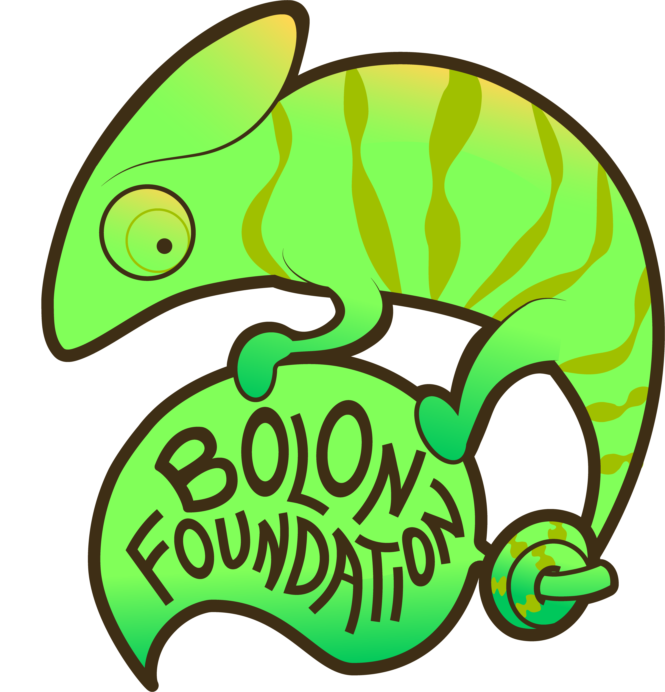

# The "I'm turning 30" conference

  

<!-- The subtitle is populated by the script at the bottom of the page -->

  

    <a href="index30yoConf.html" style="background-color: #ffffff; color: #1e293b; font-weight: 600; padding: 8px 16px; border-radius: 8px; text-decoration: none; box-shadow: 0 1px 3px rgba(0,0,0,0.1);">🏠 Home &amp; Schedule</a>
    <a href="TalksPosters.html" style="color: #475569; font-weight: 500; padding: 8px 16px; border-radius: 8px; text-decoration: none;">🎤 Talks &amp; Abstracts</a>
    <a href="photos.html" style="color: #475569; font-weight: 500; padding: 8px 16px; border-radius: 8px; text-decoration: none;">📸 Photos</a>
  

  Mfw it's my 30th birthday, and we are celebrating with a one-day conference on <strong>Tuesday, September 22, 2026</strong>.
    
  This is a -very chill- conference. People don't even need to talk about math and they can talk about whatever they want. It's just a conference for the funsies.
    
  <strong>📍 Logistics:</strong>
  <ul>
    <li>Note: There is <strong>no funding</strong> available.</li>
    <li><strong>Location:</strong> Talks will take place in <strong>Weber room 15</strong>, located in the basement of the Weber building (<a href="https://maps.app.goo.gl/1a6xwWgA2U9dCcUR9" target="_blank">Google Maps</a>).</li>
  </ul>
  

    <iframe src="https://www.google.com/maps/embed?pb=!1m18!1m12!1m3!1d3030.4302740008957!2d-105.08471192379957!3d40.576256971414324!2m3!1f0!2f0!3f0!3m2!1i1024!2i768!4f13.1!3m3!1m2!1s0x87694a577ec5e8f7%3A0x9473294e41e7e7c9!2sLouis%20R.%20Weber%2C%20Fort%20Collins%2C%20CO%2080523!5e0!3m2!1sen!2sus!4v1790019678226!5m2!1sen!2sus" width="100%" height="350" style="border:0; border-radius: 10px; max-width: 600px;" allowfullscreen="" loading="lazy" referrerpolicy="strict-origin-when-cross-origin"></iframe>
  

&nbsp;

  <table width="100%" cellpadding="10" cellspacing="10" border="0">
    <tr>
      <td valign="top" style="background-color:#f9f9f9; border-radius:10px; text-align: center;">
        <strong>📝 Registration link</strong> 
        <a href="https://forms.gle/n6R6DgoDrTwgrANZ7" style="font-weight: bold;">Click here to register!</a>
      </td>
    </tr>
  </table>

&nbsp;

  <strong>🐢 Some important notes:</strong>
  <ul>
    <li>Drinking is encouraged before, during, and after talks. Remember, drinking too little water is too easy, but drinking too much water is too hard.</li>
    <li>Poster presenters: Never mind, no one signed up for posters!</li>
  </ul>

&nbsp;

  <h3 style="margin-top: 0; color: #3f6212;">🦎 Official Conference Sponsor</h3>
  
  

    We are proudly sponsored by the <strong>Bolon Foundation</strong>!
  

  

    Be sure to check out the official <strong>Sponsor Talk</strong> by Sean "The Chameleon" Bolon during the conference.
  

&nbsp;

<h3>🌟 Plenary Speakers</h3>

  • <strong><a href="https://sites.google.com/view/makennagreenwalt/home" target="_blank">Makenna Greenwalt</a></strong>: <a href="TalksPosters.html#makenna">Mathematicians or Moles? A First Study in the Mesmerizing Psychology of Derek Moran and Enrique Mercado</a>

<h3>📢 Speakers</h3>

  • <strong>Joel Barraza</strong>: <a href="TalksPosters.html#joel">No se</a> <em>(10 mins)</em> 
  • <strong><a href="../index" target="_blank">Ignacio Rojas</a> &amp; <a href="https://mathematics.colostate.edu/person/?id=B8E51A6BA7749A35A6556816C65B3AE8&sq=t" target="_blank">Sam Scheuerman</a></strong>: <a href="TalksPosters.html#workshop">In which I help Sam run local AI, and Sam helps me with Gradescope</a> <em>(Workshop, 30 mins)</em> 
  • <strong>Trevor Overton</strong>: <a href="TalksPosters.html#trevor">What the Ballmer's Peak Can Do for You and I</a> <em>(20 mins)</em> 
  • <strong><a href="https://www.youtube.com/twigmittens" target="_blank">Sean "The Chameleon" Bolon</a></strong>: <a href="TalksPosters.html#sean">Millimeters Matter</a> <em>(Sponsor Talk &mdash; Bolon Foundation, 10 mins)</em> 
  • <strong>Michael Moy</strong>: <a href="TalksPosters.html#michaelmoy">A rubber band, a mug, and 3-sphere</a> <em>(10 mins)</em> 
  • <s><strong><a href="https://www.jon-kim.net" target="_blank">Jon Kim</a></strong>: <a href="TalksPosters.html#jonkim">On the current state of the WWE Big Show</a></s> <em>(Cancelled &mdash; couldn't make it)</em>

<h3>🤔 Potential Speakers</h3>

  • <strong>Paka</strong>: <a href="TalksPosters.html#paka">Welcome to the 3rd floor</a> 
  • <strong>Eamon</strong>: <a href="TalksPosters.html#eamon">Ahorita le aviso</a> 
  • <strong>Marieca (Ma-ree-sa)</strong>: <a href="TalksPosters.html#marieca">Why YoonHyuk Kim is literally the devil</a> 
  • <strong><a href="https://joegeisz.github.io/" target="_blank">Joe</a></strong>: <a href="TalksPosters.html#joe">uuuuuuuhhhhhhhhhhhh.........</a> 
  • <strong><a href="https://irojasr.github.io" target="_blank">El Manimal</a></strong>: <a href="TalksPosters.html#elmanimal">Things Hidden Since the Foundation of the World</a> 
  • <strong><a href="https://sites.google.com/view/viviandeleon/home" target="_blank">Vivian</a></strong>: <a href="TalksPosters.html#vivian">tbd</a> 
  • <strong>Amari</strong>: <a href="TalksPosters.html#amari">is this a conference or a birthday party I'm so confused</a> 
  • <strong><a href="https://jorqueraian.github.io/" target="_blank">Ian</a></strong>: <a href="TalksPosters.html#ian">I don't know</a>

<h3>🖼️ Posters</h3>

  No posters scheduled (no one signed up).

<h3>📅 Schedule</h3>

  <h4 style="margin-top: 0; color: #1e293b; border-bottom: 1px solid #cbd5e1; padding-bottom: 8px;">
    🗓️ Tuesday, September 22, 2026
  </h4>
  

    📍 <strong>Location:</strong> Weber room 15 (Basement of the Weber building) &mdash; <a href="https://maps.app.goo.gl/1a6xwWgA2U9dCcUR9" target="_blank">Google Maps</a>
  

  

    Schedule of talks for Tuesday:
  

  <table width="100%" cellpadding="8" cellspacing="0" style="border-collapse: collapse; margin-top: 15px; font-size: 0.95rem;">
    <thead>
      <tr style="background-color: #f1f5f9; text-align: left; border-bottom: 2px solid #cbd5e1;">
        <th style="padding: 10px; width: 28%;">Time</th>
        <th style="padding: 10px; width: 28%;">Speaker</th>
        <th style="padding: 10px; width: 44%;">Talk Title</th>
      </tr>
    </thead>
    <tbody>
      <tr style="border-bottom: 1px solid #e2e8f0;">
        <td style="padding: 10px; font-weight: 600; color: #334155;">10:20 AM &ndash; 10:30 AM</td>
        <td style="padding: 10px;">
          <strong>Joel Barraza</strong>
        </td>
        <td style="padding: 10px;">
          <a href="TalksPosters.html#joel">No se</a> (10 mins)
        </td>
      </tr>
      <tr style="border-bottom: 1px solid #e2e8f0; background-color: #fafafa;">
        <td style="padding: 10px; font-weight: 600; color: #334155;">10:30 AM &ndash; 11:00 AM</td>
        <td style="padding: 10px;">
          <strong>Ignacio Rojas &amp; Sam Scheuerman</strong> 
          🛠️ Workshop
        </td>
        <td style="padding: 10px;">
          <a href="TalksPosters.html#workshop">In which I help Sam run local AI, and Sam helps me with Gradescope</a> (30 mins) 
          A mutual-aid session: running AI locally (Codex, Antigravity, Claude) in exchange for Gradescope homework setup.
        </td>
      </tr>
      <tr style="background-color: #f8fafc; border-bottom: 1px solid #e2e8f0;">
        <td style="padding: 8px 10px; font-size: 0.85rem; color: #94a3b8;">11:00 AM &ndash; 11:30 AM</td>
        <td colspan="2" style="padding: 8px 10px; font-size: 0.85rem; color: #94a3b8; font-style: italic;">
          ☕ Intermission &amp; informal discussion
        </td>
      </tr>
      <tr style="border-bottom: 1px solid #e2e8f0;">
        <td style="padding: 10px; font-weight: 600; color: #334155;">11:30 AM &ndash; 11:50 AM</td>
        <td style="padding: 10px;">
          <strong>Trevor Overton</strong>
        </td>
        <td style="padding: 10px;">
          <a href="TalksPosters.html#trevor">What the Ballmer's Peak Can Do for You and I</a> (20 mins)
        </td>
      </tr>
      <tr style="border-bottom: 1px solid #e2e8f0; background-color: #fafafa;">
        <td style="padding: 10px; font-weight: 600; color: #334155;">11:50 AM &ndash; 12:25 PM</td>
        <td style="padding: 10px;">
          <strong>Makenna Greenwalt</strong> 
          🌟 Plenary Talk
        </td>
        <td style="padding: 10px;">
          <a href="TalksPosters.html#makenna">Mathematicians or Moles? A First Study in the Mesmerizing Psychology of Derek Moran and Enrique Mercado</a> 
          (11:50 AM &ndash; 12:20 PM talk + 5 min Q&A)
        </td>
      </tr>
      <tr style="border-bottom: 1px solid #e2e8f0;">
        <td style="padding: 10px; font-weight: 600; color: #334155;">12:25 PM &ndash; 12:35 PM</td>
        <td style="padding: 10px;">
          <strong>Sean Bolon</strong> 
          🦎 Sponsor Talk
        </td>
        <td style="padding: 10px;">
          <a href="TalksPosters.html#sean">Millimeters Matter</a> (10 mins)
        </td>
      </tr>
      <tr style="border-bottom: 1px solid #e2e8f0; background-color: #fafafa;">
        <td style="padding: 10px; font-weight: 600; color: #334155;">12:35 PM &ndash; 12:45 PM</td>
        <td style="padding: 10px;">
          <strong>Michael Moy</strong>
        </td>
        <td style="padding: 10px;">
          <a href="TalksPosters.html#michaelmoy">A rubber band, a mug, and 3-sphere</a> (10 mins)
        </td>
      </tr>
      <tr style="background-color: #f8fafc;">
        <td style="padding: 10px; font-weight: 600; color: #64748b;">12:45 PM &ndash; 1:00 PM</td>
        <td colspan="2" style="padding: 10px; color: #64748b; font-style: italic;">
          Q&A overflow, socializing, & conference celebration
        </td>
      </tr>
    </tbody>
  </table>

<h3>📸 Photos from the Conference</h3>

  

    Photos from the conference will be posted in our gallery once they are collected!
  

  <a href="photos.html" style="display: inline-block; background-color: #3b82f6; color: white; padding: 8px 18px; border-radius: 8px; text-decoration: none; font-weight: 600; box-shadow: 0 1px 3px rgba(0,0,0,0.1);">View Photo Gallery 📸</a>

  

    <strong>📝 Registration link</strong> 
    (again, because you probably skipped it from the top, lol) 
    <a href="https://forms.gle/n6R6DgoDrTwgrANZ7" style="font-weight: bold;">Click here to register!</a>
  

  <a href="../index">← Back to main page</a>

  AI tool use disclosed per the <a href="../Leiden_Declaration_on_Artificial_Intelligence_and_Mathematics.pdf">Leiden Declaration on AI and Mathematics</a>.

